# SmallTime 2027

**Die Zeiterfassung für kleine und mittlere Betriebe** – einfach im Browser, auf deinem eigenen Server, in vier Sprachen. Nachfolger von SmallTime PHP.

Version **0.9.5-beta** · [Anleitungen im Wiki](https://github.com/it-m-h/SmallTime-27/wiki) · [Lizenz](LICENSE)

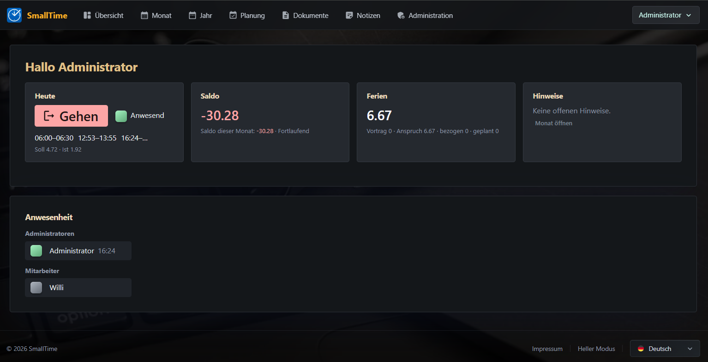

---

## Was kann SmallTime 2027?

### ⏱️ Stempeln – so, wie es zu deinem Betrieb passt

- **Ein Klick auf «Kommen» / «Gehen»** in der Übersicht, auf PC, Tablet oder Handy.
- **Stempel-Terminal** am Eingang (Tablet im Kiosk-Modus): Stempeln mit **Badge (RFID)**, **QR-Code** oder Login – mit Anwesenheitsliste.
- **Rundung der Stempelzeiten** frei wählbar, z. B. auf 15 Minuten:
  - *auf den nächsten Schritt* (08:46 → 08:45) oder
  - *Kommen aufrunden, Gehen abrunden* (Kommen 08:46 → 09:00, Gehen 16:14 → 16:00).
- **Nachtschichten** über Mitternacht, mit wählbarer Zuordnung zum Tag des Kommens, des Gehens oder geteilt um Mitternacht.
- **Schutz vor Doppelstempelungen** und Hinweis auf vergessenes Ausstempeln.

### ✍️ Zeiten erfassen und korrigieren

- **Tagesdialog** mit allen Zeiten, Absenzen und dem Tagesrapport auf einen Blick.
- **Beliebig viele Zeitblöcke pro Tag** (z. B. Vormittag, Nachmittag, Abend) – mit Uhr zum Anklicken.
- **Zeitenliste in einem Zug eingeben**: `07:30 12:00 12:30 17:00` wird automatisch zu zwei Zeitblöcken. Auch Schreibweisen wie `15.00`, `15-16`, `15,30` oder `22:00 06:00` (über Mitternacht) werden verstanden.
- Pro Zeitblock sichtbar: **Dauer, automatische Pause, Zuschlag und angerechnete Zeit**.
- **Tagesrapport** (Notiz zum Tag), z. B. für Einsatzorte oder Projekte.
- **Bearbeitungsfrist**: Der Admin legt fest, wie weit zurück Mitarbeitende noch ändern dürfen.

### 🏖️ Absenzen – auch mehrere pro Tag

- **Ferien, Krankheit, Unfall, Militär, Weiterbildung, …** – eigene Absenzarten mit **eigener Farbe** und Anrechnung in Prozent.
- Umfang wählbar: **ganzer Tag, halber Tag, in Stunden** oder **«bis Soll auffüllen»** (die fehlenden Stunden werden automatisch ergänzt).
- **Mehrere Absenzen am gleichen Tag**, z. B. ½ Tag Ferien und ½ Tag Militär – zusammen nie mehr als das Tagessoll.
- **Absenz und Arbeit am gleichen Tag**: fest anrechnen, nur bis zum Soll auffüllen oder verbieten – global oder pro Arbeitsmodell.
- **Absenzplanung im Jahreskalender**: Absenzart wählen, Tage anklicken, fertig. Arbeitstage und freie Tage sind farblich unterschieden, der **Feriensaldo rechnet sofort mit**. Planung auch für das nächste Jahr.

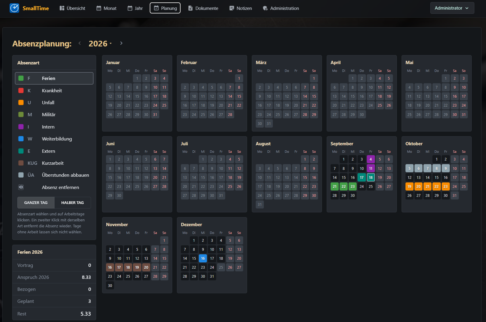

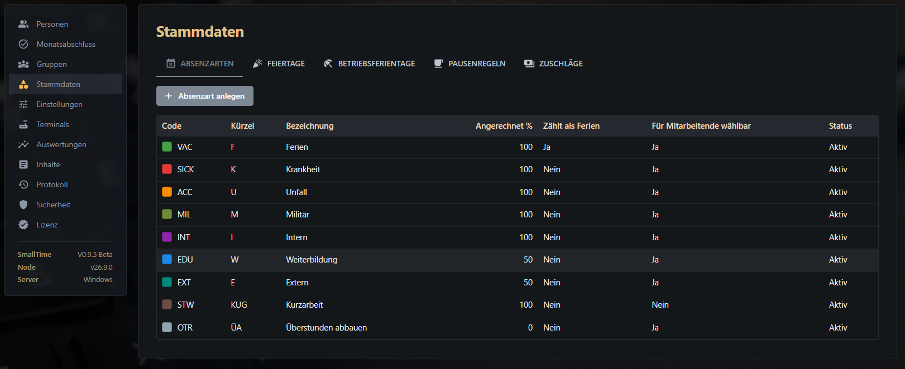

### 📅 Monats- und Jahresübersicht

- **Monatsansicht** mit Kalenderwoche, Soll, Ist, Absenzen und Saldo pro Tag; Wochenenden, Feiertage und der heutige Tag sind markiert.
- **Jahresübersicht** mit allen Monaten, Saldo-Entwicklung, Auszahlungen, Ferientagen und Status (offen / abgeschlossen / Archiv).
- **Feriensaldo pro Jahr** übersichtlich getrennt: **Vortrag, Anspruch dieses Jahr, bezogen, geplant, Rest**.
- **Übersichtsseite** mit Stempelknopf, aktuellem Saldo, Ferien, Hinweisen und – wenn freigegeben – der **Anwesenheit** der Kolleginnen und Kollegen.

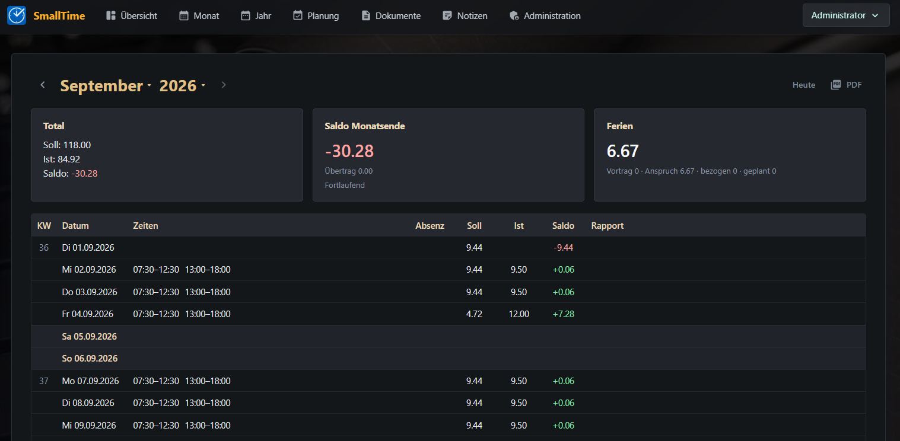

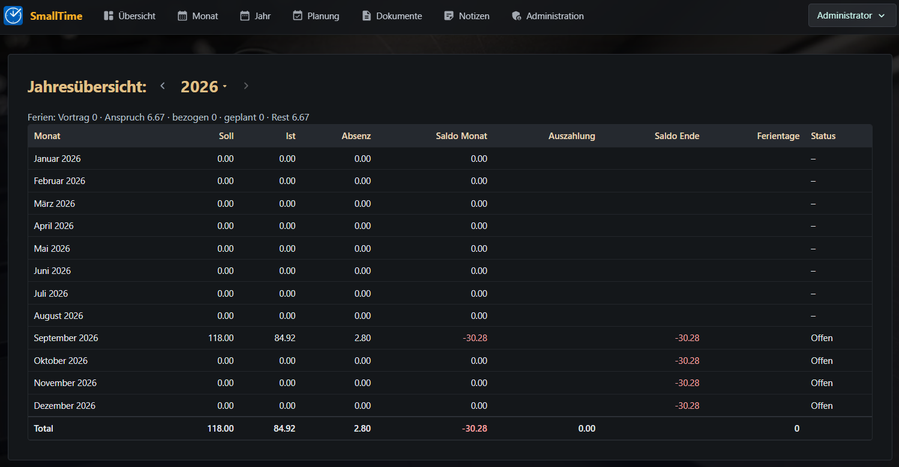

### 📄 PDF-Monatsrapport

- **Monatsrapport als PDF** auf Knopfdruck: Zeitsaldo, Ferien, alle Tage mit Zeiten und eine **detaillierte Liste der Absenzen**.
- **In der Sprache der Person** (Deutsch, Englisch, Französisch, Italienisch).
- **Automatisch beim Monatsabschluss** erstellt und bei den Dokumenten der Person abgelegt.
- **Vorschau direkt im Browser**, bevor etwas gespeichert wird.
- Dokumentenablage pro Person, inkl. Archiv-PDFs aus SmallTime PHP.

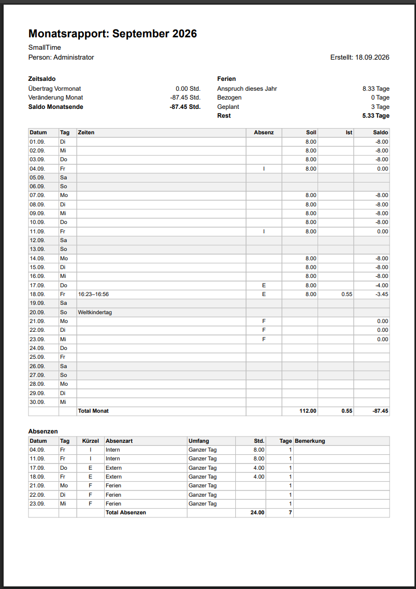

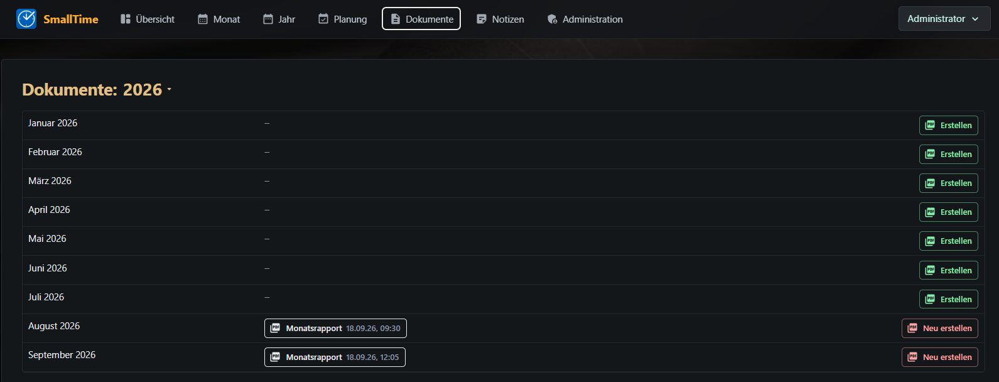

### 🧑‍💼 Arbeitsmodelle – für jede Arbeitszeit

- **Pensum und Wochenstunden** frei einstellbar, das **Tagessoll wird automatisch berechnet**.
- **Unregelmässige Arbeitstage** über Tagesfaktoren: z. B. **Montag und Freitag ganz, Dienstag bis Donnerstag halbtags** – Ferien an halben Tagen zählen dann als halber Ferientag.
- **Wechsel des Zeitmodells jederzeit** über Versionen «gültig ab»: Pensumswechsel, neue Wochenstunden oder **Sommer-/Winterarbeitszeit** – vergangene Monate bleiben unverändert.
- **Saldomodelle**: fortlaufend, Jahresabrechnung oder monatlich (Stundenlohn), mit **Vorholzeit** und Behandlung am Periodenende (Übertrag, Auszahlung, Verfall).
- **Ferienanspruch pro Jahr**, anteilig bei Eintritt oder Austritt während des Jahres.
- **Feiertagskalender** Schweiz, Deutschland, Österreich und Liechtenstein, pro Person wählbar, plus **Betriebsferientage** (ganzer Tag, halber Tag oder stundenweise frei, z. B. Heiligabend nachmittags).
- **Automatische Pausenregeln** (z. B. ab 6 Stunden 30 Minuten) und **Zuschläge** für Nacht, Sonntag und Feiertag – als Zeitgutschrift oder nur zur Auswertung.

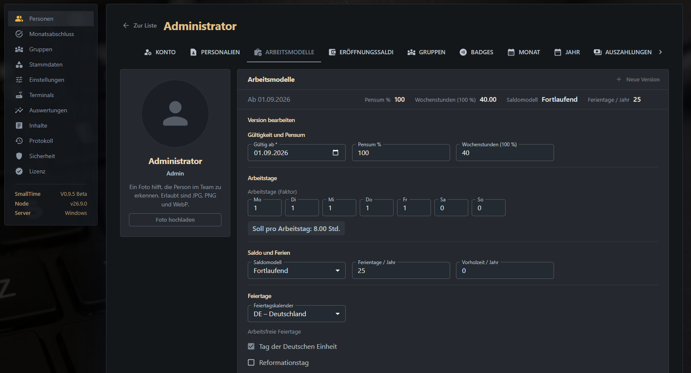

### ✅ Monatsabschluss und Auszahlungen

- **Monatsabschluss für alle oder ausgewählte Personen** mit automatischer Prüfung (offene Zeiten, unbestätigte lange Arbeitszeiten, offener Vormonat …).
- Direkt aus dem Abschluss: **Monat ansehen und korrigieren** oder **PDF-Vorschau** öffnen.
- **Wieder öffnen**, falls etwas vergessen wurde – mit Begründung, lückenlos protokolliert.
- **Auszahlungen von Überstunden** erfassen und im Saldo verrechnen.
- **Eröffnungssaldi** für Stunden und Ferien beim Start oder nach einer Übernahme.

### 👥 Personen, Gruppen und Rechte

- **Personenverwaltung** mit Konto, Personalien, Foto, Arbeitsmodellen, Eröffnungssaldi, Gruppen und Badges – alles übersichtlich in Karten und direkt bearbeitbar.
- **Gruppen mit eigenem Bild** und eigenen Berechtigungen: Zeiten nachtragen, Stempel ändern, Absenzen erfassen, Tagesrapporte, Anwesenheit sehen, Druckfrist.
- **Rollen** Admin und Mitarbeitende; Mitarbeitende sehen nur ihre eigenen Daten.

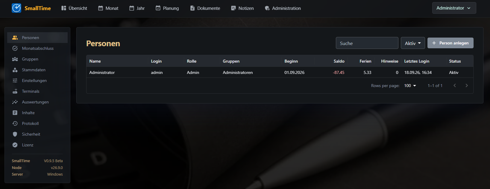

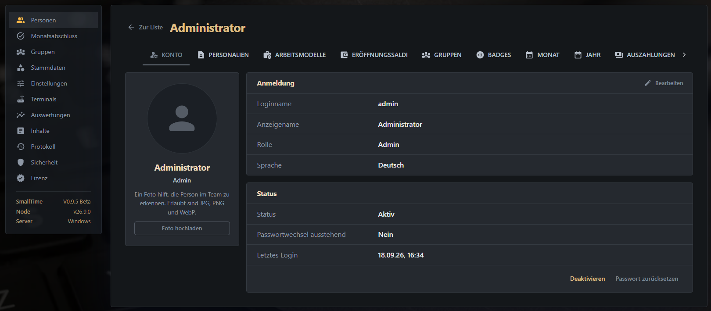

### 📊 Auswertungen und Protokoll

- **Absenzenkalender** für alle Personen auf einen Blick, **Jahresstatistik** und **CSV-Export** (z. B. für die Lohnbuchhaltung).
- **Import von Stempelzeiten** aus CSV-Dateien.
- **Protokoll** aller Änderungen und ein eigener Reiter **«Anmeldungen»** mit erfolgreichen und fehlgeschlagenen Anmeldungen.

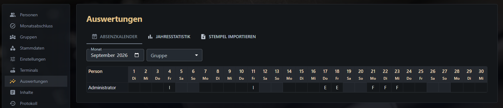

### 🔒 Sicherheit und Betrieb

- **Deine Daten bleiben bei dir**: SmallTime läuft auf deinem eigenen Server oder Hosting.
- **Sichere Anmeldung**: Startpasswort muss geändert werden, **Kontosperre nach 30 Fehlversuchen**, Entsperren durch den Admin.
- **Wöchentliche automatische Kopie der Datenbank.**
- Firmenname im Kopf der Seite, eigenes Aussehen über `custom.css`, **hell/dunkel**, Deutsch, Englisch, Französisch und Italienisch.
- Eigene Inhaltsseiten (z. B. Impressum, Datenschutz) direkt im Browser bearbeiten.

### 🔄 Umstieg von SmallTime PHP

Alle **Personen, Zeiten, Absenzen, Saldi, Tagesrapporte und Archiv-PDFs** werden beim ersten Start automatisch übernommen. Alte Monate bleiben als unveränderliches Archiv sichtbar. Anleitung: [Umstieg von SmallTime PHP](https://github.com/it-m-h/SmallTime-27/wiki/Server-Umstieg-von-SmallTime-PHP).

---

## Anleitungen

| Ich bin … | Anleitung |
|---|---|
| Mitarbeiterin / Mitarbeiter | [Erste Schritte für Anwender](https://github.com/it-m-h/SmallTime-27/wiki/Anwender-Erste-Schritte) |
| Admin (Chef/in, Personalverantwortliche/r) | [Erste Schritte für Admins](https://github.com/it-m-h/SmallTime-27/wiki/Admin-Erste-Schritte) |
| Ich richte SmallTime ein | [Installation Schritt für Schritt](https://github.com/it-m-h/SmallTime-27/wiki/Server-Installation-Schritt-fuer-Schritt) |
| Informatikerin / Informatiker | [Übersicht für die Informatik](https://github.com/it-m-h/SmallTime-27/wiki/IT-Uebersicht) |

---

## Kurz zur Installation

Du brauchst [Node.js](https://nodejs.org) Version **26**. Dieses Repository herunterladen, `.env.example` als `.env` kopieren und ausfüllen, dann im Ordner `npm install --omit=dev` und `npm start` ausführen und <http://localhost:55000> öffnen (Start-Login **admin** / **admin1234**). Alles Weitere Schritt für Schritt: [Installation](https://github.com/it-m-h/SmallTime-27/wiki/Server-Installation-Schritt-fuer-Schritt).

---

## Lizenz und Haftung

> SmallTime 2027 ist eine kommerzielle Software und **keine Open-Source-Software**: Dass die Dateien hier öffentlich sind, erlaubt keine Weitergabe oder Veränderung. Es gelten die [Lizenzbedingungen](LICENSE).

- **Lizenz:** privat bis 2 Personen dauerhaft gratis. Firmen, Vereine, Nonprofit-Organisationen, öffentliche Stellen und Selbständige brauchen immer einen Lizenzschlüssel (pro aktiver Person und Monat gemäss Preisliste), siehe [LICENSE](LICENSE).
- **Keine Gewährleistung, keine Haftung:** Die Software wird «wie besehen» geliefert. Jede Haftung ist im gesetzlich grösstmöglichen Umfang ausgeschlossen. Du bist selbst verantwortlich für Datensicherung, die Prüfung aller Berechnungen und die Einhaltung gesetzlicher Vorschriften (z. B. Arbeitsgesetz, Datenschutz).
- **Fremdbibliotheken:** SmallTime nutzt Open-Source-Bibliotheken unter ihren eigenen Lizenzen, aufgeführt in [THIRD-PARTY-LICENSES.md](THIRD-PARTY-LICENSES.md).

Copyright © 2026 IT-Master Heizmann. Alle Rechte vorbehalten.
